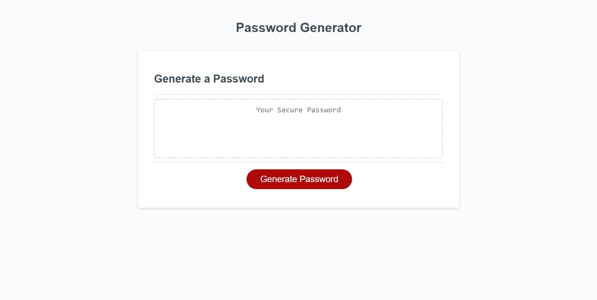

# Password-Generator

## Overview

This is a simple password generator application that allows users to customize and generate secure passwords based on specified criteria.

## Screenshot

## Features

- Choose password length between 8 and 128 characters.
- Include or exclude lowercase, uppercase, numeric, and special characters.
- Dynamically generated passwords.

## Usage

1.Open <> in your web browser.
2.Click the "Generate Password" button.
3.Follow the prompts to specify password length and character types.
4.View the generated password in the designated area.

## Deployment

The deployed application is available at the following URL: <>

## References

Developer, F. (2022, June 2). Random password generator using Javascript. DEV Community. <https://dev.to/code_mystery/random-password-generator-using-javascript-6a>
GeeksforGeeks. (2023, August 11). How to generate a random password using JavaScript ? <https://www.geeksforgeeks.org/how-to-generate-a-random-password-using-javascript/>
